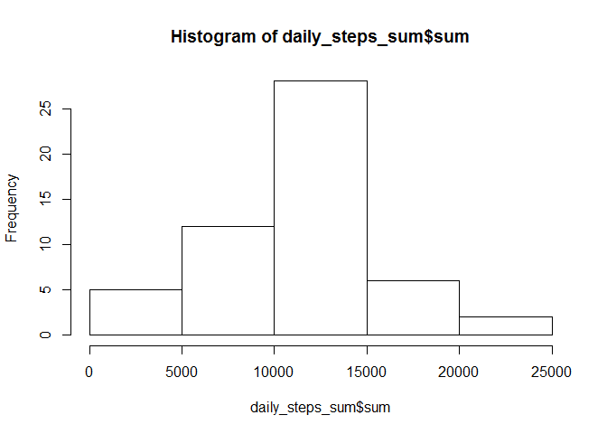
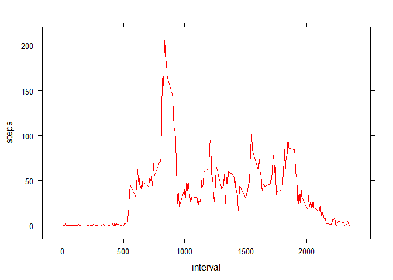
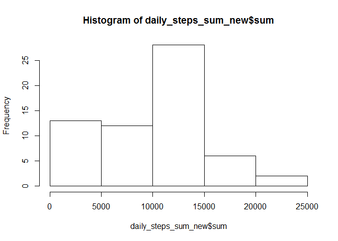
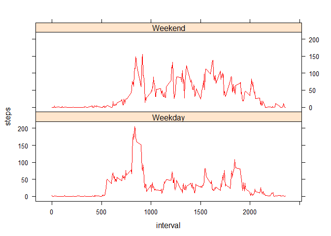

# Reproducible Research: Peer Assessment 1


## Loading and preprocessing the data
### 1.Load the data (i.e. read.csv())

```r
setwd("D:/Dropbox/nisarg_dss_home/5_reproducible_research/non_sync_peer_assign_1")
rawdata <-read.csv("activity.csv",header = TRUE)
```
#### Basic Data QC

```r
head(rawdata)
```

```
##   steps       date interval
## 1    NA 2012-10-01        0
## 2    NA 2012-10-01        5
## 3    NA 2012-10-01       10
## 4    NA 2012-10-01       15
## 5    NA 2012-10-01       20
## 6    NA 2012-10-01       25
```

```r
summary(rawdata)
```

```
##      steps                date          interval     
##  Min.   :  0.00   2012-10-01:  288   Min.   :   0.0  
##  1st Qu.:  0.00   2012-10-02:  288   1st Qu.: 588.8  
##  Median :  0.00   2012-10-03:  288   Median :1177.5  
##  Mean   : 37.38   2012-10-04:  288   Mean   :1177.5  
##  3rd Qu.: 12.00   2012-10-05:  288   3rd Qu.:1766.2  
##  Max.   :806.00   2012-10-06:  288   Max.   :2355.0  
##  NA's   :2304     (Other)   :15840
```

### 2.Process/transform the data (if necessary) into a format suitable for your analysis

Data processing done later in section "Imputing missing values"


## What is mean total number of steps taken per day?

### 1.Calculate the total number of steps taken per day:


```r
library(dplyr)
```

```
## Warning: package 'dplyr' was built under R version 3.2.3
```

```
## 
## Attaching package: 'dplyr'
```

```
## The following objects are masked from 'package:stats':
## 
##     filter, lag
```

```
## The following objects are masked from 'package:base':
## 
##     intersect, setdiff, setequal, union
```

```r
grp <- group_by(rawdata, date)
daily_steps_sum<-summarise(grp, sum=sum(steps))
```

### 2.Make a histogram of the total number of steps taken each day:

```r
hist(daily_steps_sum$sum)
```

<!-- -->

### 3.Calculate and report the mean and median of the total number of steps taken per day:

```r
summary(daily_steps_sum)
```

```
##          date         sum       
##  2012-10-01: 1   Min.   :   41  
##  2012-10-02: 1   1st Qu.: 8841  
##  2012-10-03: 1   Median :10765  
##  2012-10-04: 1   Mean   :10766  
##  2012-10-05: 1   3rd Qu.:13294  
##  2012-10-06: 1   Max.   :21194  
##  (Other)   :55   NA's   :8
```
Mean = 10766
Median = 10765

## What is the average daily activity pattern?

### 1.Make a time series plot (i.e. type = "l") of the 5-minute interval (x-axis) and the average number of steps taken, averaged across all days (y-axis)


```r
#calculate the average steps taken in each 5min interval across all the days:

interval_summary <-aggregate( steps~interval, rawdata, mean )

head(interval_summary)
```

```
##   interval     steps
## 1        0 1.7169811
## 2        5 0.3396226
## 3       10 0.1320755
## 4       15 0.1509434
## 5       20 0.0754717
## 6       25 2.0943396
```

```r
dim(interval_summary)
```

```
## [1] 288   2
```

```r
#plot the time series data
library("lattice")

xyplot(steps ~ interval ,
       data = interval_summary,
       type = "l",
       col.line =  "red")
```

<!-- -->

### 2.Which 5-minute interval, on average across all the days in the dataset, contains the maximum number of steps?

```r
#find the max value of the steps mean
summary(interval_summary)
```

```
##     interval          steps        
##  Min.   :   0.0   Min.   :  0.000  
##  1st Qu.: 588.8   1st Qu.:  2.486  
##  Median :1177.5   Median : 34.113  
##  Mean   :1177.5   Mean   : 37.383  
##  3rd Qu.:1766.2   3rd Qu.: 52.835  
##  Max.   :2355.0   Max.   :206.170
```

```r
#subet the data with the max value
max <- subset(interval_summary, steps > 206.16)
#print the interval with the max steps
max
```

```
##     interval    steps
## 104      835 206.1698
```
The 5-minute interval with the maximum number of average steps, across all days = 835 

## Imputing missing values
### 1. Calculate and report the total number of missing values in the dataset (i.e. the total number of rows with NAs)


```r
summary(rawdata)
```

```
##      steps                date          interval     
##  Min.   :  0.00   2012-10-01:  288   Min.   :   0.0  
##  1st Qu.:  0.00   2012-10-02:  288   1st Qu.: 588.8  
##  Median :  0.00   2012-10-03:  288   Median :1177.5  
##  Mean   : 37.38   2012-10-04:  288   Mean   :1177.5  
##  3rd Qu.: 12.00   2012-10-05:  288   3rd Qu.:1766.2  
##  Max.   :806.00   2012-10-06:  288   Max.   :2355.0  
##  NA's   :2304     (Other)   :15840
```
THe dataset has 2,304 rows with missing values. All of them are in the variable - Steps

### 2. Devise a strategy for filling in all of the missing values in the dataset. The strategy does not need to be sophisticated. For example, you could use the mean/median for that day, or the mean for that 5-minute interval, etc.

Missing imputation strategy: impute the missing values of the 5 minute interval for a day, with the median value of that 5-minute interval, across all the other days where it is not missing

```r
#calculate the median of the steps in all the 5-minute intervals, across all days
interval_median_impute <-aggregate( steps~interval, rawdata, median )
summary(interval_median_impute)
```

```
##     interval          steps       
##  Min.   :   0.0   Min.   : 0.000  
##  1st Qu.: 588.8   1st Qu.: 0.000  
##  Median :1177.5   Median : 0.000  
##  Mean   :1177.5   Mean   : 3.962  
##  3rd Qu.:1766.2   3rd Qu.: 0.000  
##  Max.   :2355.0   Max.   :60.000
```

```r
#rename the steps variable in the imputation data
names(interval_median_impute)<-c("interval","steps_median")
```
### 3.Create a new dataset that is equal to the original dataset but with the missing data filled in:


```r
#merge the median data with the raw data
interim_data <- merge(rawdata,interval_median_impute,by="interval")
summary(interim_data)
```

```
##     interval          steps                date        steps_median   
##  Min.   :   0.0   Min.   :  0.00   2012-10-01:  288   Min.   : 0.000  
##  1st Qu.: 588.8   1st Qu.:  0.00   2012-10-02:  288   1st Qu.: 0.000  
##  Median :1177.5   Median :  0.00   2012-10-03:  288   Median : 0.000  
##  Mean   :1177.5   Mean   : 37.38   2012-10-04:  288   Mean   : 3.962  
##  3rd Qu.:1766.2   3rd Qu.: 12.00   2012-10-05:  288   3rd Qu.: 0.000  
##  Max.   :2355.0   Max.   :806.00   2012-10-06:  288   Max.   :60.000  
##                   NA's   :2304     (Other)   :15840
```

```r
#impute the missing values of the steps variables by the median wherever applicable
for (i in 1:nrow(interim_data)) 
     {
     if (is.na(interim_data[i,2]) == TRUE) {interim_data[i,2] <- interim_data[i,4]}
     } 
processed_data <-interim_data
summary(processed_data)
```

```
##     interval          steps             date        steps_median   
##  Min.   :   0.0   Min.   :  0   2012-10-01:  288   Min.   : 0.000  
##  1st Qu.: 588.8   1st Qu.:  0   2012-10-02:  288   1st Qu.: 0.000  
##  Median :1177.5   Median :  0   2012-10-03:  288   Median : 0.000  
##  Mean   :1177.5   Mean   : 33   2012-10-04:  288   Mean   : 3.962  
##  3rd Qu.:1766.2   3rd Qu.:  8   2012-10-05:  288   3rd Qu.: 0.000  
##  Max.   :2355.0   Max.   :806   2012-10-06:  288   Max.   :60.000  
##                                 (Other)   :15840
```

### 4.Make a histogram of the total number of steps taken each day and Calculate and report the mean and median total number of steps taken per day. Do these values differ from the estimates from the first part of the assignment? What is the impact of imputing missing data on the estimates of the total daily number of steps?


```r
library(dplyr)
grp <- group_by(processed_data, date)
daily_steps_sum_new<-summarise(grp, sum=sum(steps))

hist(daily_steps_sum_new$sum)
```

<!-- -->

```r
summary(daily_steps_sum_new)
```

```
##          date         sum       
##  2012-10-01: 1   Min.   :   41  
##  2012-10-02: 1   1st Qu.: 6778  
##  2012-10-03: 1   Median :10395  
##  2012-10-04: 1   Mean   : 9504  
##  2012-10-05: 1   3rd Qu.:12811  
##  2012-10-06: 1   Max.   :21194  
##  (Other)   :55
```
The mean as well as the median have dropped to lower values than before:
 Median :10,395  
 Mean   : 9,504  

## Are there differences in activity patterns between weekdays and weekends?

### 1.Create a new factor variable in the dataset with two levels - "weekday" and "weekend" indicating whether a given date is a weekday or weekend day.


```r
for (i in 1:nrow(processed_data)) 
     {
     if ((weekdays(as.Date(processed_data[i,3])) == "Sunday") | (weekdays(as.Date(processed_data[i,3])) == "Saturday") ==TRUE) {processed_data[i,5] <- "Weekend"}
     else {processed_data[i,5] <- "Weekday"}
} 

names(processed_data)<-c("interval","steps","date","steps_median","Weekend_ind")
table(processed_data$Weekend_ind)
```

```
## 
## Weekday Weekend 
##   12960    4608
```
### 2.Make a panel plot containing a time series plot (i.e. type = "l") of the 5-minute interval (x-axis) and the average number of steps taken, averaged across all weekday days or weekend days (y-axis). See the README file in the GitHub repository to see an example of what this plot should look like using simulated data.


```r
#calculate the average steps taken in each 5min interval across all the days (weekend and weekdays separately):

interval_summary_wknd <-aggregate( steps~interval+Weekend_ind, processed_data, mean )

head(interval_summary_wknd)
```

```
##   interval Weekend_ind      steps
## 1        0     Weekday 2.02222222
## 2        5     Weekday 0.40000000
## 3       10     Weekday 0.15555556
## 4       15     Weekday 0.17777778
## 5       20     Weekday 0.08888889
## 6       25     Weekday 1.31111111
```

```r
dim(interval_summary_wknd)
```

```
## [1] 576   3
```

```r
#plot the time series data
library("lattice")

xyplot(steps ~ interval | Weekend_ind,
       data = interval_summary_wknd,
       type = "l",
       col.line = "red",layout=c(1,2))
```

<!-- -->
